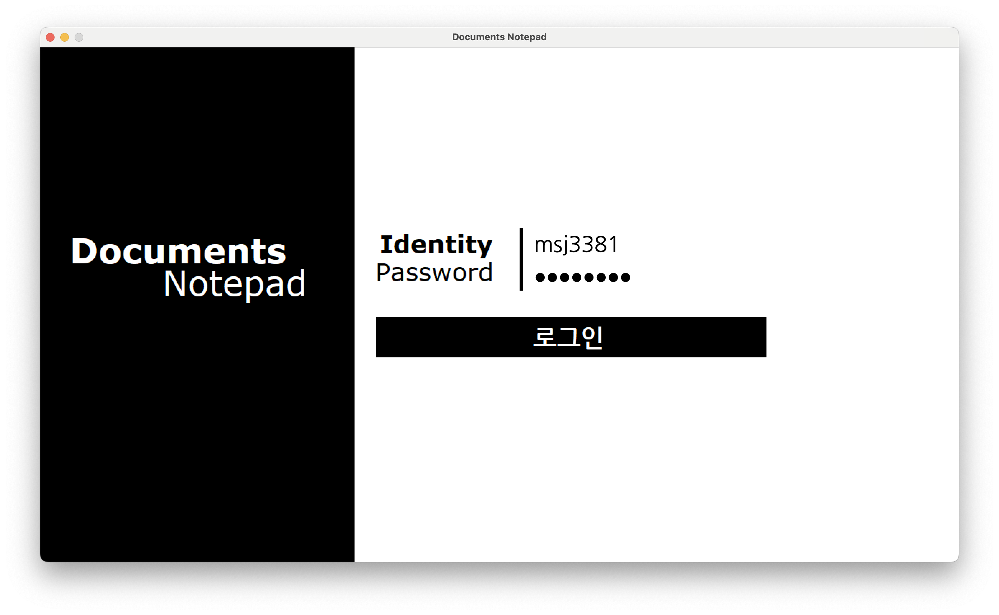
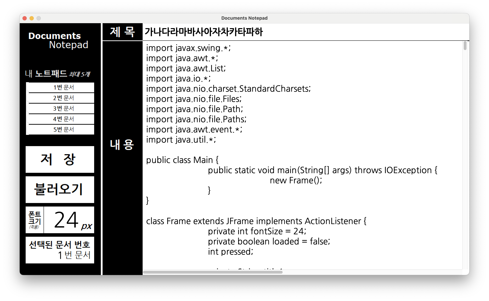

# Java를 이용한 간단한 메모 애플리케이션
 Java의 Swing을 활용하여 간단한 메모 애플리케이션을 만들었습니다.  
 ``Swing``, ``ActionListener``, ``JList``, ``File`` 등을 사용하였으며 기능은  
 제목을 포함한 최대 5개의 문서 열람 및 편집, 글꼴 크기 조정, 로그인 기능 등이 있습니다.  
 UI 이미지 제작은 Windows에 내장되어 있는 그림판을 사용하였습니다.

# Simple Documents Application Using Java
I made a simple documents application using Swing of Java.  
``Swing``, ``ActionListener``, ``JList``, ``File`` and etc. were used and there are  
functions of opening and editing up to 5 documents including titles,  
adjusting the size of the font and logging in.  
I used the MSPaint of Windows for making images of UI.

